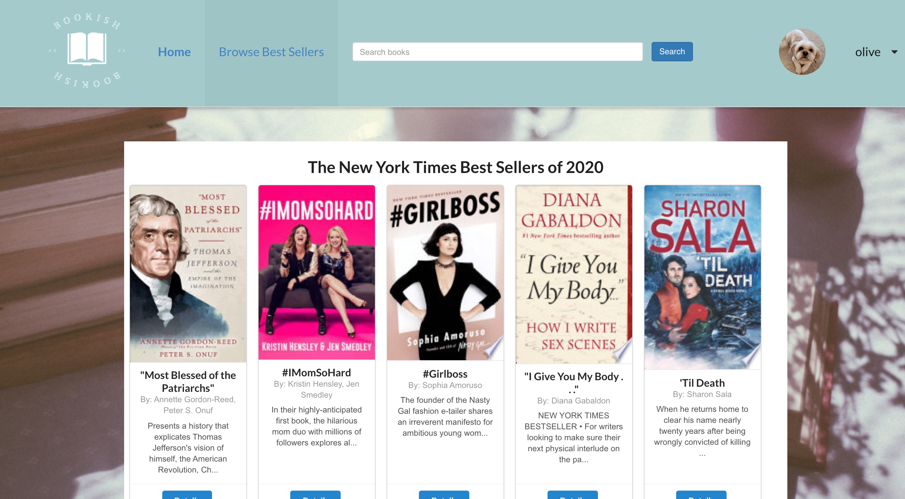
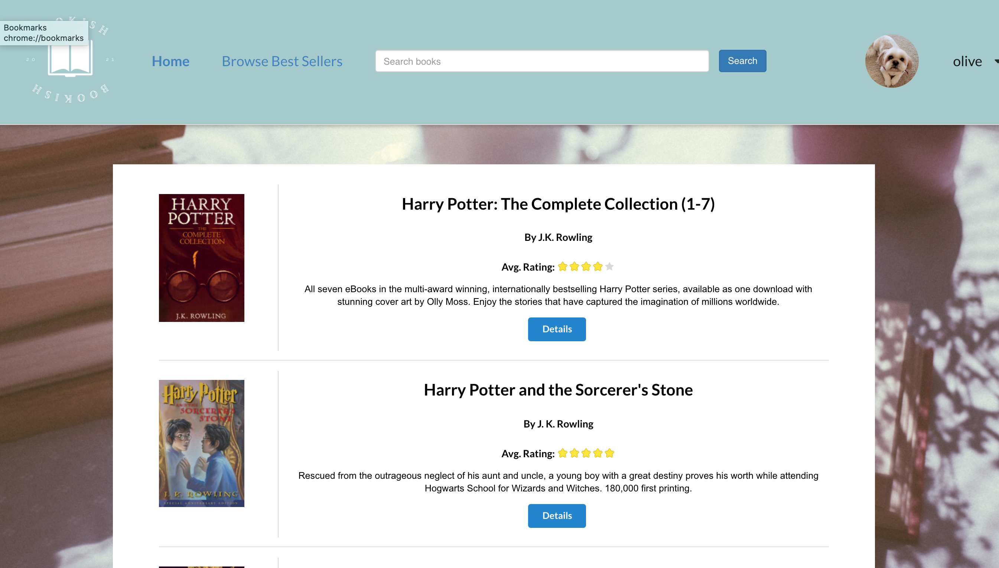
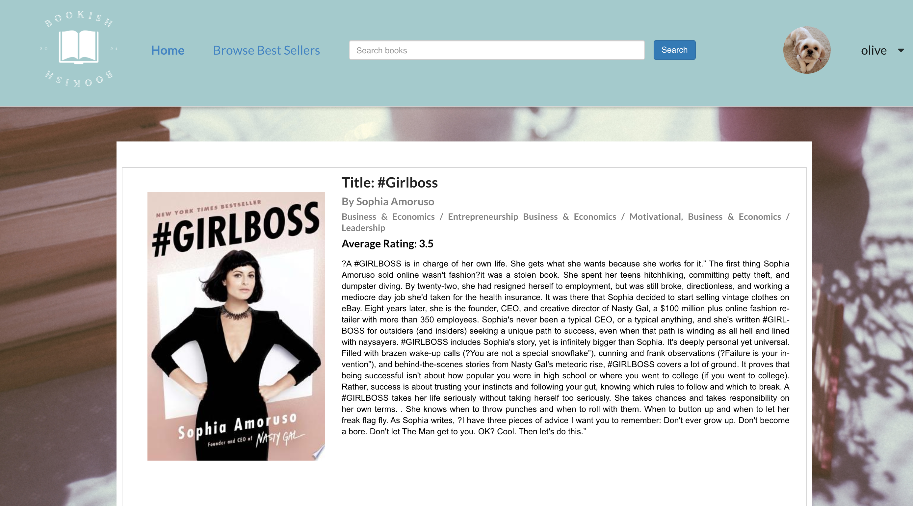

# Bookish (Book Search App)
---
## Table of Contents

* [About the Project](#about-the-project)
* [Technologies Used](#technologies-used)
* [Getting Started](#getting-started)
* [Next Steps](#next-steps)

# About The Project
Bookish is a search site for books using the Google Books API. It also uses the NY Times Book API to render their Best Seller Lists, which renders the Google Books information. It uses authorization to access the site through sign up and log in.

Sign Up and Log In Pages

Once you sign up or log in, you are redirected to the Home Page that has the main search bar, along with links to the Best Sellers Lists and your Profile.

On the best sellers list, information is pulled from the NY Times API and uses Google Books API to render images and information on each of the books on the list.

You can search for a book from any page on the app by any attribute of a book (author, title, isbn, category), and the search bar will take you to the Search Results page. Here, details are rendered up with up to 40 book results at a time.

On the Book Details list, you see more information and a more indepth description of each book.

# Technologies Used

* Javascript for interactive functions
* CSS for Styling
* React
* MongoDB
* Express
* Mongoose
* Node.js

# Getting Started

* [Click to launch the app](https://bookish-search-app.herokuapp.com/)
    * See the live application here
    * Note - If you'd like to access any page on the site, you must be signed up/logged in

* [Trello Board - Project Planning](https://trello.com/b/ntcckX7F)
    * This Trello Board was used to do all project planning and includes:
        * ERD
        * Project To Do List
        * Original wireframes for the project
        * Bugs to fix
        * Ice Box 

# Next Steps

## Features I'd like to add to enhance this project:

* Add the ability to add a book to a user's "Want to Read", "Read", or "Favorite" list and have these lists be viewable from the user's profile
* Be able to add/edit/delete comments or reviews onto each of the books
* Display more than one list from the New York Times and have each list option displayed and link to a show page for each that will render all books on the list
* Add the ability for the user to update any user information, or delete the user from the system
